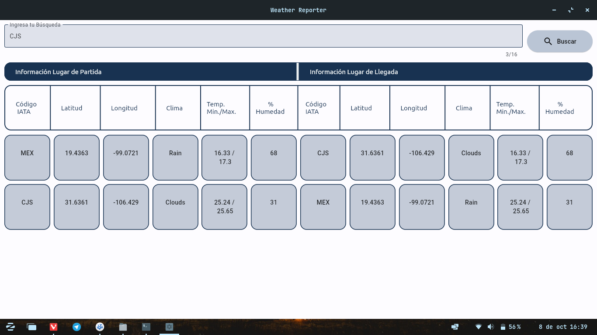
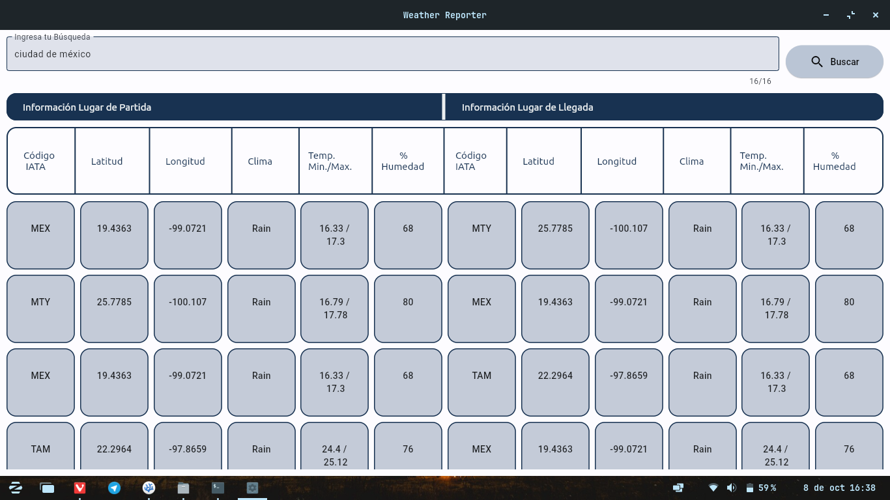
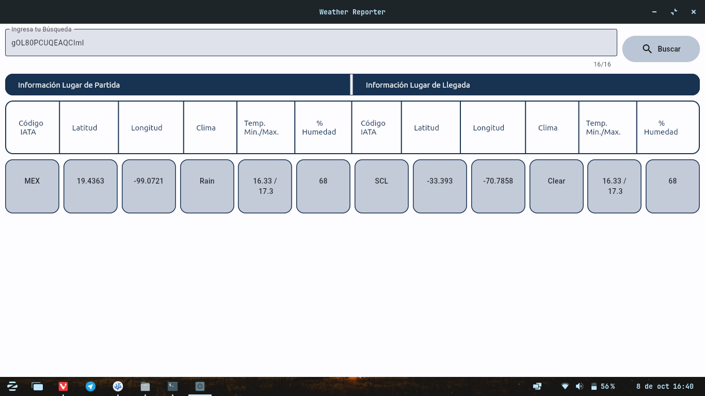

# Reporte del Clima para Aeropuertos

## Dependencias 

Primeramente es necesario tener Python y Git instalados en el sistema en sus versiones más recientes. 

La mejor forma de hacerlo es seguir las instrucciones oficiales tanto del lenguaje
de programación como del programa, ambas en sus webs oficiales.

Uno puede instalar Python dando click [aquí](https://www.python.org/downloads/).
Por su lado, las descargas de Git se encuentran en [este enlace](https://git-scm.com/downloads).

Es necesario seguir las instrucciones en pantalla de ambos programas antes de seguir 
con los pasos siguentes.

Ahora se abre una terminal (en Windows puede ser Powershell, en sistemas
Mac y Linux la preferida funciona sin ningun problema) y se introduce línea por línea lo siguiente:

```
 git clone https://github.com/Wallsified/WeatherReport
 cd WeatherReport/ 
```

## Ejecución del Programa

Dependiendo de la plataforma y/o la forma en la que se desee ejecutar el programa, existen dos formas de 
hacerlo:

### Ejecución en Windows mediante Archivo Ejecutable

Anexado al proyecto se incluyes archivos llamados _Weather Reporter-Windows_. Antes de descomprimir el archivo, primero es necesario [desactivar temporalmente Windows Defender](https://support.microsoft.com/es-es/windows/deshabilitar-la-protecci%C3%B3n-antivirus-de-defender-en-seguridad-de-windows-99e6004f-c54c-8509-773c-a4d776b77960). No por que el programa contenga código malicioso, si no que no posee certificados de seguridad (temporalmente).

Posteriormente, se descomprime el archivo y se entra a la carpeta descomprimida resultante. Dentro de esta, la estructura se debe de ver como la siguiente:

```
Weather Reporter - NombreDePlataforma
├── assets
│   ├── dataset2.csv
│   └── name-iata.csv
└── WeatherReporter
```

Es importante que la carpeta _assets_ se mantenga en esa ubicación y no sufra modificaciones, ya que en esta es donde se encuentran los archivos de las bases de datos para el programa. 

El archivo a ejecutar es _WeatherReporter_, basta con darle doble click para poderlo ejecutar.

### Ejecución en Mac / Linux / Terminal (Todas las Plataformas)

Nuevamente ocupando la terminal, y en la carpeta donde se encuentra el proyecto descargado, se realiza lo siguiente: 

```
 python3 -m venv .env
 source /.env/bin/activate
 pip install -r Resources/requirements.txt
```

Una vez realizados los pasos anteriores, basta con ejecutar la siguiente linea en la misma terminal: 

```
flet run GUI/weather_reporter.py
```

## Funcionamiento del Programa

El programa permite buscar de 3 formas diferentes: _Código IATA, Ciudad_ o _Número de Ticket_. Ejemplos de lo anterior se muestran a continuación: 

### Búsqueda por Código IATA



### Búsqueda por Ciudad



### Búsqueda por Número de Ticket



## Notas a la Ejecución

- Al ejecutar el programa por primera vez se crea el caché de los resultados por lo que es normal esperar unos cuantos segundos para mostrar el resultado. Posteriormente al crear nuevas búsquedas los resultados se muestran de manera más inmediata (según la cantidad de resultados, puede variar entre 2-8 segundos aproximadamente.) 

- Al buscar por Código IATA o por ciudad es normal ver múltiples resultados. Para poder observarlos basta con hacer _scroll_ dentro de la sección de resultados.  